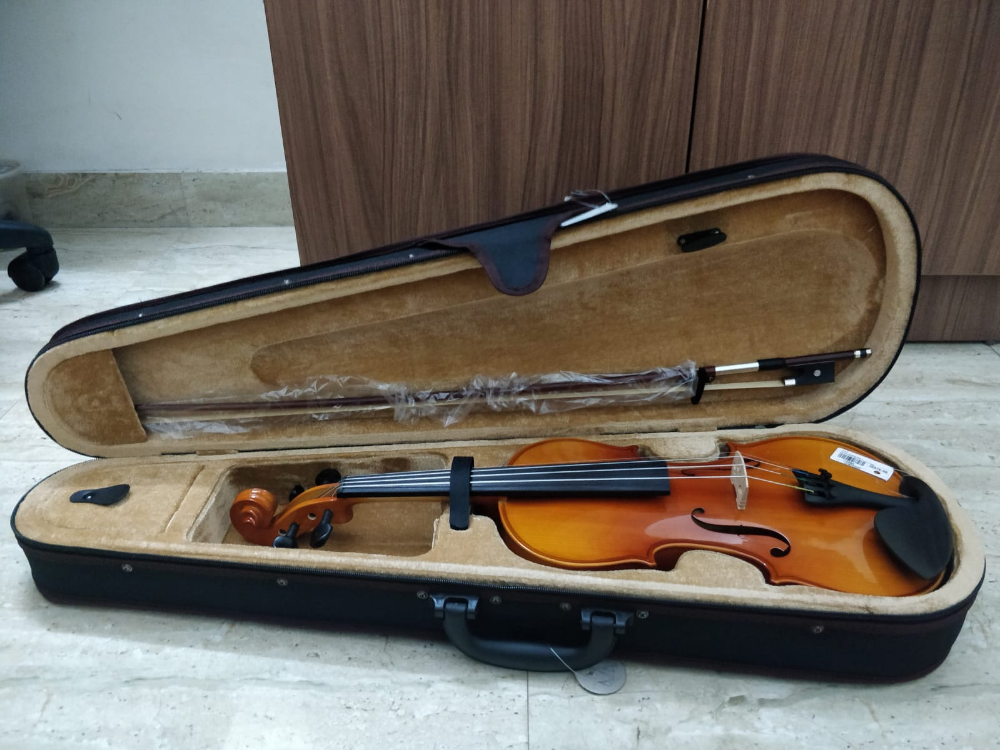

# Hurt Your Ears

Category: Forensics

Author: Kavya Bhat

Answer / Flag: `WEC{MUS1CEV3RYWHER3}`

## Problem Statement

Here's a picture of my brand new violin! I play at all times of the day, and never express any reMorse for hurting my friends' ears :P. However, I do send them Surreptitiously Tucked Enigmatic Goodies Hidden In Digital Envelopes.

I've shared one such envelope with you, can you find my message? Send it back to me without any whitespace, and enclosed within `WEC{}`.

## Relevant files / links

## Solution

`binwalk -e violin.jpeg` only detects a JPEG file, and is not of much use. However, the last line of the problem statement hints to using steghide. `steghide extract -sf violin.jpeg` gives us a text file, but that too seems to contain gibberish. `file output.txt` shows that it is actually a WAVE audio file. Rename the file to `output.wav`. 

On playing the audio file, we hear a series of short and long beeps, which is typical of Morse Code. Using a [Morse Code Audio Decoder](https://morsecode.world/international/decoder/audio-decoder-adaptive.html) to decode the audio file, we get the flag `MUS1CEV3RYWHER3`

