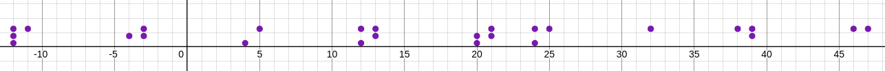

# Mr. Crankyblind

Category: OSINT

Author: Kavya Bhat

Answer / Flag: `WEC{POINTMAD3}`

## Problem Statement

Mr. Crankyblind,  
he's quite the sight,  
Glasses thick, and eyes that fight.  
He makes his point, though can't see straight,  
And argues till it's much too late.

Enclose your answer within `WEC{}`.

## Relevant files / links

<https://drive.google.com/drive/folders/1g745Kjv_jNfhbkbqCNxvwQPkUAk_i01W?usp=sharing>

## Solution

The .csv file contains a set of points. On plotting these in any [online graphing tool](https://www.desmos.com/calculator), we see that some points are grouped closely together, and quite some distance apart from the other groups. 

The problem statement heavily refers to blindness, and that leads you to use a chart for Braille to decode the points. 

Both the letter `C` and the number `3` are represented the same in Braille, which gives us 2 options - `POINTMADC` and `POINTMAD3`. Based on the general replacement of E with 3, we conclude that the flag is `POINTMAD3`.
