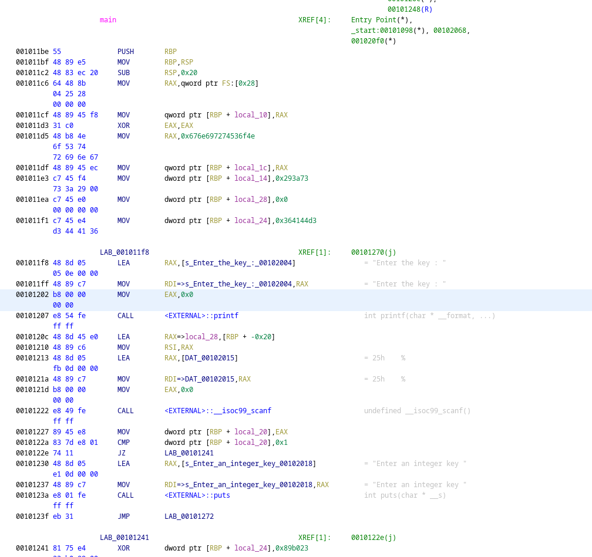

# Gold Rush

Category: Reverse Engineering

Author: Aditya Harish

Answer / Flag: `WEC{r3v3rs3__3ngg}`

## Problem Statement

While mining for gold in **low levels** of the Earth, you come across this binary executable which gives you the flag provided that you enter the correct key.  
## Relevant files / links
Executable:
https://drive.google.com/file/d/1S73n4tlCO_kyDN3o_HXsbsJyyhQ3ZFRi/view?usp=sharing

## Solution

Shorter reverse engineering techniques like ltrace, strace and strings won't work for this problem. On analyzing the disassembled binary, we can observe that the program XORs the key with 0x30dbb before checking if it matches with the user's input. Moreover, the key is XORed with `0x89b023` for every wrong attempt. So with one wrong attempt, the key is reset to its original value(a XOR a = 0). So the flag can be obtained by inputting a random number initially and then inputting the value obtained after `0x364144d3 ^ 0x30dbb`. RE tools like Ghidra/IDA makes analysis easier for this question. 
     

